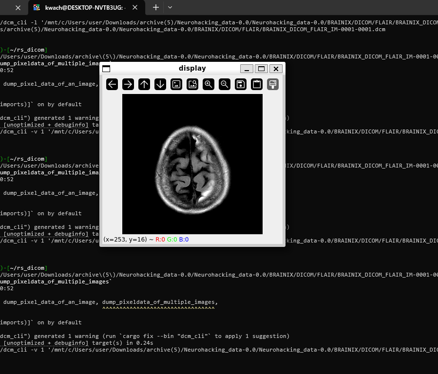

# dcm_cli

A minimal commandline application to interact with dicom files. 

<figure>
  
  <figcaption>Figure 1 — Typical dicom file containing a CT scan.</figcaption>
</figure>

<figure>
  
  <figcaption>Figure 1 — Typical dicom file containing a FLAIR CT scan of the brain.</figcaption>
</figure>


## Installation

I am yet to expose the binary releases for `dcm_cli` therefore
to use it you'll build it from source.

Run `curl --proto '=https' --tlsv1.2 -sSf https://sh.rustup.rs | sh` to install rust.

To use the binary cli ensure you have rust installed.

### Linux

```
    sudo apt install libopencv libclang
    git clone https:://github.com/KwachOjunga/rs_dicom
    cd rs_dicom
    cargo b -- --help
```


Clone the repo and `cd rs_dicom` into the directory
Run `cargo install --bin dcm_cli --path=.` ro create the binary file.
To use, view the options available via
`dcm_cli -h`

Roadmap
---
- [ ] Support other medical formats.(NIFTI)
