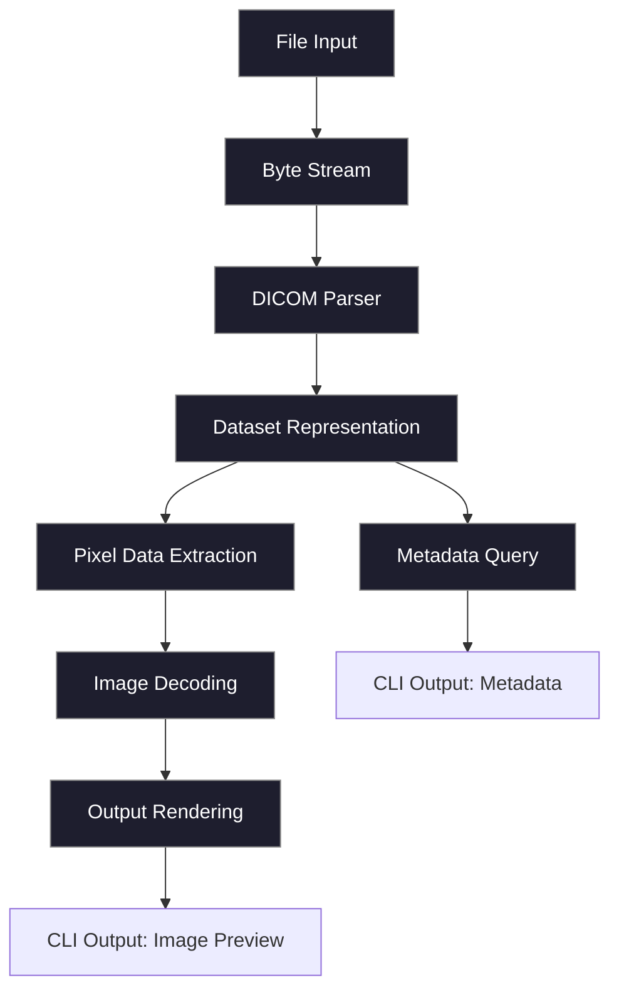

# rs_dicom

<figure>
  
  <figcaption>Figure 1 — Typical dicom file containing a CT scan.</figcaption>
</figure>

A systems-oriented Rust implementation for working with **DICOM (Digital Imaging and Communications in Medicine)** data.

This project explores how medical imaging formats can be modeled, parsed, and manipulated using **strongly typed, memory-safe, and performance-aware abstractions**.

> ⚠️ Status: Early-stage, evolving design.

---

# 1. Why This Project Exists

DICOM is not just a file format—it is a **protocol + schema + encoding system** layered over decades of design decisions.

That is useful—but limiting if your goal is:

* building new tooling (e.g. streaming pipelines, custom decoders)
* experimenting with parsing strategies
* understanding the *mechanics* of the format

`rs_dicom` is built with a different philosophy:

> Treat DICOM image viewing as a **systems problem**, that can be made painless.

---

# 2. Design Philosophy

### 2.1 Explicitness Over Convenience

All key transformations—from raw bytes to structured elements—should be visible and controllable.

### 2.2 Separation of Concerns

The system relies on abstractions that decompose into:

* byte-level parsing
* semantic representation
* higher-level utilities

These layers are intentionally **loosely coupled**.

### 2.3 Zero-Cost Abstractions

Rust abstractions should not obscure performance characteristics.

Where possible:

* iterators over allocations
* borrowed data over owned data or COW

---

# 3. Architectural Overview

The project can be understood as a pipeline:



---

## Dicom Parser Layer

Responsible for:

* interpreting byte streams into DICOM primitives
* decoding:

  * tags `(group, element)`
  * VR (Value Representation)
  * length fields
  * value payloads

This layer is where complexity accumulates:

* implicit vs explicit VR
* undefined lengths
* nested sequences

---

## 3.3 Core Data Model

Represents DICOM structures as Rust types:

### Core Concepts

* **Tag**

  ```text
  (group, element)
  ```

* **VR (Value Representation)**
  Defines how data should be interpreted:

  * `PN` (Person Name)
  * `UI` (UID)
  * `OB` (Byte string)
  * etc.

* **Data Element**

  ```text
  Tag + VR + Length + Value
  ```

* **Dataset**
  A collection of elements, potentially nested.

---

# 4. Parsing Strategy

DICOM parsing is fundamentally a **stateful binary decoding problem**.

Key challenges include:

### 4.1 Dicom's Transfer Syntax

Determines:

* endianness
* VR encoding (explicit vs implicit)

### 4.2 Variable-Length Encoding

Elements may be:

* fixed-length
* undefined-length (terminated by delimiters)

### 4.3 Nested Sequences

Sequences introduce recursion:

* items within items
* delimiter-based termination

---

## 4.4 Streaming vs Buffered Parsing

A major design question:

| Strategy  | Trade-off             |
| --------- | --------------------- |
| Buffered  | simpler, memory-heavy |
| Streaming | complex, scalable     |

`rs_dicom` is designed to eventually support **streaming-first parsing**.

---

# 5. Example Usage (Conceptual)

```rust
use rs_dicom::parser::parse_file;
use rs_dicom::core::Tag;

fn main() -> Result<(), Box<dyn std::error::Error>> {
    let dataset = parse_file("image.dcm")?;

    let patient_name = dataset.get(Tag(0x0010, 0x0010));
    let modality = dataset.get(Tag(0x0008, 0x0060));

    println!("{:?} {:?}", modality, patient_name);

    Ok(())
}
```

---

# 6. Current Capabilities

* Basic DICOM file parsing 
* Dicom Image Viewing
* Tag and element representation
* Foundational data structures

---

# 7. Roadmap

## Short Term

* Complete element parsing
* Support explicit + implicit VR
* Improve error handling

## Medium Term

* Sequence handling
* Streaming parser
* Tag dictionary integration

## Long Term

* Pixel data decoding
* DIMSE (network protocol)
* WASM compatibility
* Integration with visualization pipelines

---

# 9. Intended Use Cases

This project is especially suited for:

* systems programmers exploring binary formats
* researchers building custom imaging pipelines
* developers interested in:
* hobbyists keen on C++ and Rust interop


  * memory layout design
  * zero-copy architectures

---

# 10. Development

### Build
Install [rust](https://rust-lang.org/tools/install/)

```bash
sudo apt install libopencv libclang
git clone https:://github.com/KwachOjunga/rs_dicom
cd rs_dicom
```
Run `cargo install --bin dcm_cli --path=.` ro create the binary file.
To use, view the options available via
`dcm_cli -h`
---


# 14. License

MIT OR Apache-2.0

---

# 15. Final Note

This project is less about *just parsing DICOM* and more about:

> understanding how complex binary protocols can be modeled in a modern systems language.

If you are interested in:

* medical imaging data formats/handling 
* binary formats
* memory models
* protocol design

then this project and the ecosystem that enables it should feel familiar.
